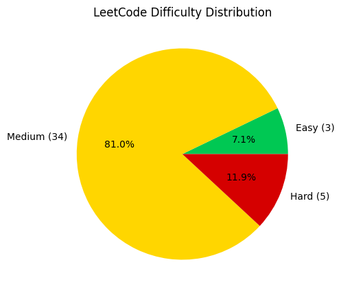
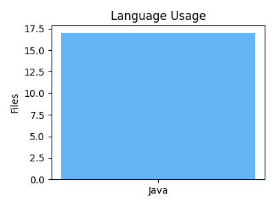
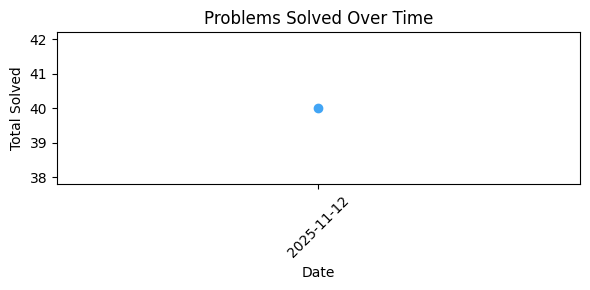

# 🚀 LeetCode Solutions

### 🧮 Progress
`█░░░░░░░░░░` **0%** (17 / 2800 problems)
🕓 Last Updated: **12 Nov 2025, 05:07 PM**

### 🧠 Language Split
🐍 Python: 0% ☕ Java: 94%

## 🧘 Quote of the Run
> 💡 Talk is cheap. Show me the code.

## 🤝 Contributors

### 🥇 Top Contributor

 **Prabhat Kapkoti 🥇**

---
Generated automatically by GitHub Actions 🚀
